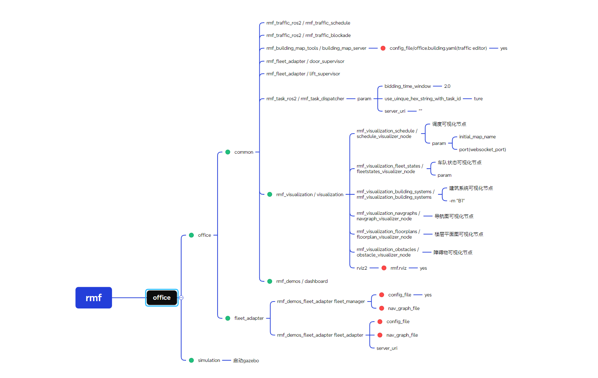
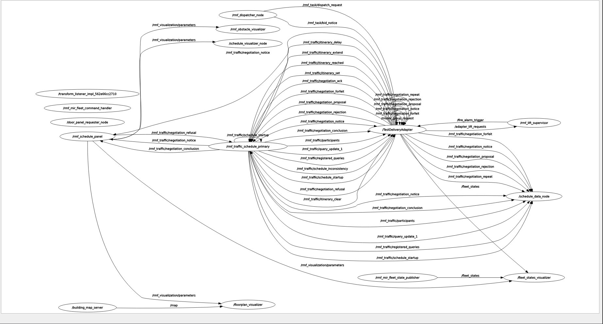

# 1. The Main Packages Used to Build RMF
## 1.1 rmf

[下载](images/launch.png)
这个图片里面是openrmf里面的office.launch.xml文件里面对应的启动节点和作用

[下载](images/rmf.png)
这个是rmf集群中所用节点和消息的概览
## 1.2 rmf_adapter_mir
### 1.2.1 Nodes
#### a. TestDeliveryAdapter
这个节点是在main函数的create_fleet(config,nav_graph_path, mock=mock)方法中创建的，对应的语句如下，这个节点是最主要的节点，在fleet_adapter_mir中rmf和mir交流的桥梁，主要是在MirCommandHandle.py中创建了一个定时器`self.state_update_timer = self.node.create_timer`(170行)，不断调用两个方法来实现机器人的移动

```python linenums="107" title="In file fleet_adapter_mir.py of package fleet_adapter_mir"
# RMF_CORE Fleet Adapter: Manages delivery or loop requests
if mock:
    adapter = adpt.MockAdapter(config['node_names']['rmf_fleet_adapter'])
else:
    adapter = adpt.Adapter.make(config['node_names']['rmf_fleet_adapter'])
```
具体的实现在rmf_ros2仓库中的rmf_fleet_adapter_python中，同时rmf_fleet_adapter_python中是用pybind11将rmf_fleet_adapter中的C++代码转换为了一个叫rmf_adapter的python动态库，然后就可以直接在python文件中用import rmf_adapter来调用功能
#### b. rmf_mir_fleet_command_handler
已知ros2调用包时，会根据`setup.py`里面的`entry_points`来执行对应的main函数
</br>
main函数只是声明了一个叫rmf_mir_fleet_command_handler的node并且添加运行了一下
```python linenums="1" title="main中的相关语句"
def main(argv=sys.argv):
  cmd_node = rclpy.node.Node(config['node_names']['robot_command_handle'])
  #The value of config['node_names']['robot_command_handle' is rmf_mir_fleet_command_handler
  rclpy_executor.add_node(cmd_node)
  cmd_node.destroy_node()
```

```python linenums="340" title="In file fleet_adapter_mir.py of package fleet_adapter_mir"
handle_data = {
    'fleet_handle': fleet,
    'fleet_name': fleet_name,
    'adapter': adapter,
    'node': cmd_node, #this is relative to node rmf_mir_fleet_command_handler
    'graph': nav_graph,
    'robot_traits': robot_traits,
    'transforms': transforms
}
```
python中参数传递默认是传递引用，所以node的功能会受到MirCommandHandle类的影响,具体要了解`MirCommandHandle.py`中的代码

```python linenums="192" title="In file fleet_adapter_mir.py of package fleet_adapter_mir"
robot = MiRCommandHandle(
        name=robot_name,
        node=handle_data['node'],
        rmf_graph=handle_data['graph'],
        robot_traits=handle_data['robot_traits'],
        robot_state_update_frequency=rmf_config.get('robot_state_update_frequency', 1),
        dry_run=dry_run
)
```
#### c. rmf_mir_fleet_state_publisher
这个在main函数里面主要是声明了一个叫`rmf_mir_fleet_state_publisher`的`node`,定义了会发布`FleetState`消息的发布者`fleet_state_pub`，用定时器`fleet_state_timer`定时调用发布者的发布方法`fleet_state_pub.publish(fleet_state)`来发布`FleetState`消息

```python linenums="357" title="In file fleet_adapter_mir.py of package fleet_adapter_mir"
# INIT FLEET STATE PUB ====================================================
if config['rmf_fleet']['publish_fleet_state']:# 这个在配置文件mir_config.yaml里面value: Ture
    fleet_state_node = rclpy.node.Node(config['node_names']['fleet_state_publisher'])
    #The value of config['node_names']['fleet_state_publisher'] is rmf_mir_fleet_state_publisher
    fleet_state_pub = fleet_state_node.create_publisher(
        FleetState,
        config['rmf_fleet']['fleet_state_topic'],
        1
    )
    rclpy_executor.add_node(fleet_state_node)

    def create_fleet_state_pub_fn(fleet_state_pub, fleet_name, robots):
        def f():
            fleet_state = FleetState()
            fleet_state.name = fleet_name

            for robot in robots.values():
                fleet_state.robots.append(robot.robot_state)

            fleet_state_pub.publish(fleet_state)
        return f

    fleet_state_timer = fleet_state_node.create_timer(
        config['rmf_fleet']['fleet_state_publish_frequency'],
        create_fleet_state_pub_fn(fleet_state_pub, fleet_name, robots)
    )
```


